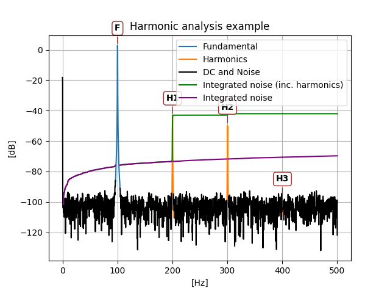

There are two main functions:

- `harm_analysis`: for simulations with an injected tone, returning SNR, THDN, Noise, etc.
- `spec_analysis`: for cases without an injected tone, that auto-detects DC, tones, and noise from the spectrum.


## `harm_analysis` example usage

This example generates a tone with noise, harmonics and a DC value.

```python
--8<-- "examples/example_usage.py"
```

outputs:

```
Parameters:
fund_db: 3.0103285457895366
fund_freq: 100.1299984247558
dc_db: -18.17423020970596
noise_db: -69.92423670970405
thd_db: -45.053400519370584
snr_db: 72.93456525549358
sinad_db: 45.04633222911549
thdn_db: -45.04633222911549
total_noise_and_dist: -42.036003683325944
```



## `spec_analysis` example usage

```python
--8<-- "examples/example_spectrum_analysis.py"
```

outputs:
FIXME
