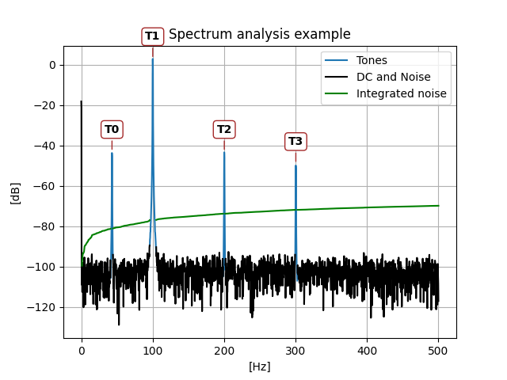

There are two main functions:

- `harm_analysis`: for simulations with an injected tone, returning SNR, THDN, Noise, etc.
- `spec_analysis`: for cases without an injected tone, that auto-detects DC, tones, and noise from the spectrum.


## `harm_analysis` example usage

This example generates a tone with noise, harmonics and a DC value.

```python
--8<-- "examples/example_usage.py"
```

outputs:

``` title="examples/example_usage.md"
--8<-- "examples/example_usage.md"
```


## `spec_analysis` example usage

```python
--8<-- "examples/example_spec_analysis.py"
```

outputs:

``` title="examples/example_spec_analysis.md"
--8<-- "examples/example_spec_analysis.md"
```


